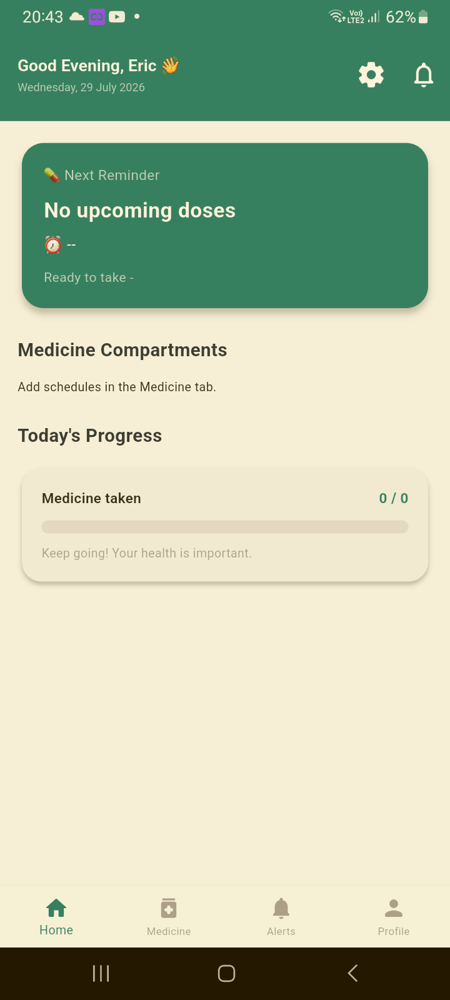
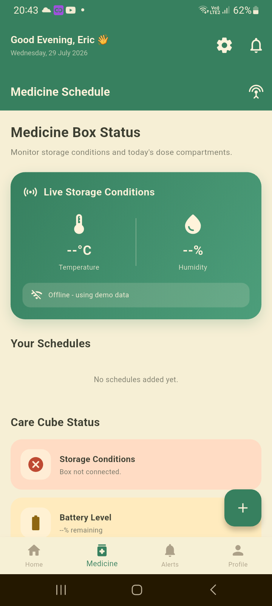
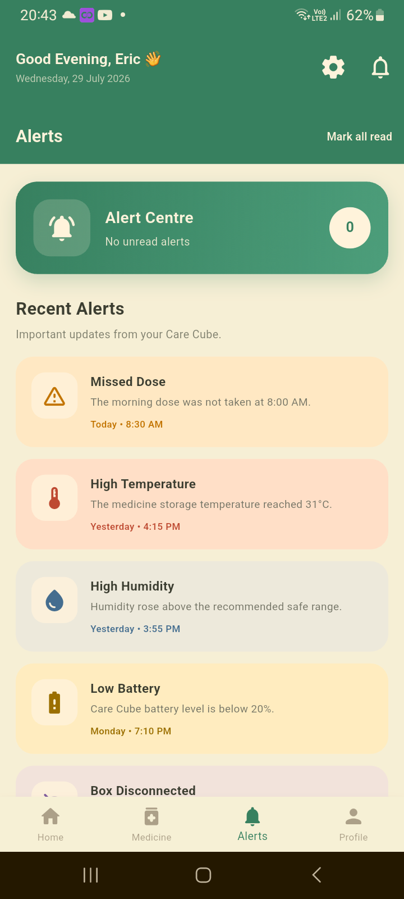
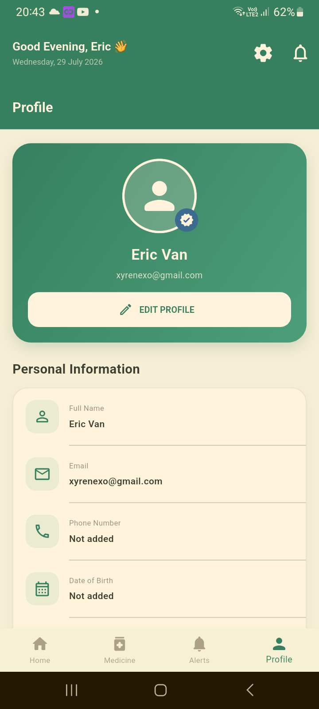

# Care Cube - Smart Medicine Box 💊

[](https://flutter.dev)
[](https://dart.dev)
[](https://supabase.com)
[](https://mqtt.org)


**Care Cube** is a smart medicine box management application designed to help patients and caregivers track medication schedules, monitor storage conditions, and ensure timely dosage through IoT integration.

## 🚀 Features

- **Real-time Scheduling**: Add and manage medicine schedules with precise timing and compartment mapping.
- **IoT Integration**: Connects with an ESP32-based Smart Medicine Box via MQTT for live updates.
- **Live Monitoring**: Track storage conditions (Temperature & Humidity) within the medicine box.
- **Smart Notifications**: Receive alerts and alarms when it's time to take your medication.
- **Supabase Backend**: Secure user authentication and real-time data synchronization across devices.
- **Progress Tracking**: Monitor daily medicine intake progress at a glance.

## 🛠️ Technologies Used

- **Framework**: [Flutter](https://flutter.dev)
- **Backend**: [Supabase](https://supabase.com) (Auth, Database, Realtime)
- **Communication**: [MQTT](https://mqtt.org) (HiveMQ Broker)
- **Local Storage**: `shared_preferences`
- **Notifications**: `flutter_local_notifications`

## 📦 Getting Started

### Prerequisites

- Flutter SDK (v3.12.2 or higher)
- Android Studio / VS Code
- A Supabase Project (URL and Anon Key required)

### Installation

1. **Clone the repository**
   ```bash
   git clone https://github.com/ZephyrNULL/care_cube-flutter.git
   cd care_cube-flutter
   ```

2. **Install dependencies**
   ```bash
   flutter pub get
   ```

3. **Configure Supabase**
   Update `lib/services/supabase_config.dart` with your project credentials:
   ```dart
   class SupabaseConfig {
     static const String supabaseUrl = 'YOUR_SUPABASE_URL';
     static const String supabaseAnonKey = 'YOUR_SUPABASE_ANON_KEY';
   }
   ```

4. **Run the app**
   ```bash
   flutter run
   ```

## Screenshots

<p align="center">
  
  
  
  
</p>

